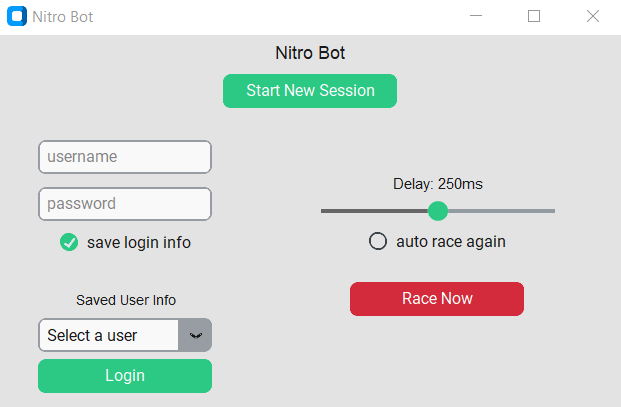

# Nitro Bot
A Python bot created with Selenium and CustomTkinter that automates the game nitrotype.com.

This bot was made after discussions I had with my roommates on whether it was possible to create a bot to play this game for us. Check out the talented [Andrew Fang](https://github.com/AndFang)'s bot on his page!

## Installing and Running
- Clone repository
- Run the following command in terminal: ```pip install -r requirements.txt```
- Run the program: ```python main.py```

Note: make sure you have python installed.

## How to use
This is the GUI that appears when running the program:


1. Click ```Start New Session``` button to open a new Selenium chrome instance.
2. If you have saved user data before, you can select it from the drop down menu. Otherwise, enter your information in the fields.
3. Check whether you would like your user information to be saved or not. This information will be saved to a file called ```userinfo.txt```. Information is saved to this file when the application is closed, and loaded from this file when the application is opened. Information is saved internally in the program when the ```Login``` button is pressed.
4. Once logged in, pressing the ```Race Now``` button will start a race, whereas checking the ```auto race again``` checkbox will loop racing without needing to click any buttons.
5. Changing the delay slider will change how much time is between each key press. **Please note that excessively fast speeds WILL get your account banned. You are responsible for any lost accounts due to this occurrence.**
6. To log out or restart, press the ```Start New Session``` button. This will close the current session and start a new one, where you will not be logged in anymore. At this point, reenter your credentials and login again.
7. You will get the best experience only interacting through the GUI and not through the web page itself.

## Disclaimer
This bot is meant for educational purposes only. Using this bot, especially at high speeds, could result in a ban. Please use this application to learn about some of the capabilities of Python, CustomTkinter, and Selenium.

&copy; Tyler Hinrichs 2023
